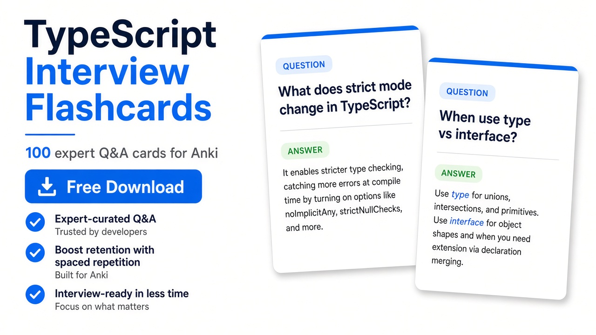

# TypeScript Interview Flashcards Free

**Walk into your TypeScript interview prepared.** 100 curated questions with clear, structured answers you can recall under pressure. Study on your phone, tablet, or computer.

**[Download `TypeScript_Interview_2026.apkg`](https://github.com/tomaszs/typescript-interview-flashcards-free/releases/download/v2026.1/TypeScript_Interview_2026.apkg)** · free for personal study · no GitHub account required

## Table of contents

- [Get started](#get-started)
- [Download](#download)
- [Who this is for](#who-this-is-for)
- [Why Anki and flashcards](#why-anki-and-flashcards)
- [Anki apps by platform](#anki-apps-by-platform)
- [Install on your device](#install-on-your-device)
- [Deck contents](#deck-contents)
- [Sample questions](#sample-questions)
- [How to study](#how-to-study)
- [Card format](#card-format)
- [FAQ](#faq)
- [About the creator](#about-the-creator)
- [About Summon The JSON](#about-summon-the-json)
- [More decks](#more-decks)
- [Trademark notice](#trademark-notice)
- [License](#license)
- [Changelog](#changelog)

## Get started

1. **Install Anki** for your device ([see links below](#anki-apps-by-platform)).
2. **[Download `TypeScript_Interview_2026.apkg`](https://github.com/tomaszs/typescript-interview-flashcards-free/releases/download/v2026.1/TypeScript_Interview_2026.apkg)** from the latest release.
3. **Import** the file in Anki on the same device and start studying.

## Download

| | |
| --- | --- |
| **Latest release** | [v2026.1](https://github.com/tomaszs/typescript-interview-flashcards-free/releases/latest) |
| **Direct .apkg** | [TypeScript_Interview_2026.apkg](https://github.com/tomaszs/typescript-interview-flashcards-free/releases/download/v2026.1/TypeScript_Interview_2026.apkg) |
| **File size** | ~1 MB (varies by deck) |
| **Cost** | Free for personal study |
| **Account** | No GitHub account required |

## Who this is for

- Developers preparing for **TypeScript** technical interviews
- **Software Engineer** candidates who want structured Q&A, not random trivia
- Anki users who prefer **spaced repetition** for interview prep
- Anyone searching for **typescript interview flashcards free** or a **typescript anki deck**

## Why Anki and flashcards

### What are flashcards?

A flashcard is a simple question on one side and the answer on the other. You **try to recall the answer from memory** before you flip the card. That act of retrieval is called **active recall**, and it is one of the most effective ways to move knowledge from short-term reading into long-term memory.

### What is Anki?

[Anki](https://apps.ankiweb.net/) is a flashcard app built around **spaced repetition**. Instead of cramming everything in one sitting, Anki schedules each card based on how well you know it:

- Cards you find **easy** appear less often.
- Cards you **miss** come back sooner.
- You study a **small daily queue** instead of re-reading the full deck every time.

You spend more time on weak spots and less on what you already know.

### How spaced repetition works

1. Anki shows you a card.
2. You recall the answer, then reveal the back.
3. You rate how hard it was (for example: Again, Hard, Good, Easy).
4. Anki calculates the **next review date** for that card.
5. Over days and weeks, well-known cards fade out while difficult ones stay in rotation.

The result: steady progress with less total study time than passive re-reading.

### Why flashcards are great for tech interviews

Tech interviews are not only coding puzzles. You also need to **explain how things work**, compare trade-offs, and handle follow-up questions without freezing. Flashcards train exactly that skill.

**They match how interviews actually feel**

- An interviewer asks one focused question. You answer from memory. A flashcard is the same loop.
- You get immediate feedback on the back: did you miss a pitfall, a trade-off, or a follow-up angle?
- Repeated practice turns shaky explanations into answers you can deliver calmly.

**They fill gaps LeetCode does not cover**

- Coding practice builds implementation skill. Flashcards build **verbal depth**: language internals, architecture choices, debugging, production concerns.
- For **TypeScript** roles, interviewers often probe fundamentals (how it works, when to use it, what breaks in production) even when there is no whiteboard task.
- This deck covers those talking points in a format you can review daily.

**They turn passive reading into active recall**

- Reading documentation or blog posts feels productive, but recognition is not recall.
- Flashcards force you to **produce** an answer before you see the solution.
- That difference shows up in phone screens, panel rounds, and "explain this to me" moments.

**They help you study in small sessions**

- 10 minutes on the bus, between meetings, or before bed adds up.
- Spaced repetition resurfaces weak cards automatically, so you do not need one giant cram session the night before.
- You can keep **TypeScript** topics warm for weeks without burnout.

**They build confidence for follow-ups**

- Strong candidates do not stop at a one-line answer. They mention edge cases, alternatives, and real-world constraints.
- Each card in this deck is structured to support that: short answer first, then depth, pitfalls, and likely follow-ups.
- The goal is not memorizing scripts. It is knowing your material well enough to adapt when the interviewer pushes back.

This deck is built for that: one interview question per card, structured answers on the back.

### Why flashcards still matter in the AI era

AI can summarize docs, generate examples, and answer questions on demand. That is useful, but interviews still test **what you can produce from your own head** in real time.

Flashcards complement AI rather than replace them:

| AI alone | Flashcards + Anki |
| --- | --- |
| Easy to **read** an explanation and feel you understand it | Forces **recall** without hints |
| Answers fade if you do not revisit the topic | **Spaced repetition** brings weak cards back automatically |
| Risk of shallow "I saw this in ChatGPT" familiarity | Builds **durable memory** for whiteboard and verbal rounds |
| Great for exploring new topics | Great for **locking in** what you must explain clearly |

Use AI to explore and clarify. Use Anki to **remember, retrieve, and perform** when it counts. Candidates who combine both tend to interview more confidently than those who only consume generated answers.

## Anki apps by platform

Install the official Anki app for the device you want to study on, then import the `.apkg` on that same device.

| Platform | App | Get it |
| --- | --- | --- |
| **Windows** | Anki | [Download Anki](https://apps.ankiweb.net/) |
| **macOS** | Anki | [Download Anki](https://apps.ankiweb.net/) |
| **Linux** | Anki | [Download Anki](https://apps.ankiweb.net/) |
| **iPhone / iPad** | AnkiMobile | [App Store](https://apps.apple.com/app/ankimobile-flashcards/id373493387) |
| **Android** | AnkiDroid | [Google Play](https://play.google.com/store/apps/details?id=com.ichi2.anki) |

Desktop Anki **2.1.49+** or newer. AnkiMobile and AnkiDroid are kept up to date via their app stores.

## Install on your device

Download [`TypeScript_Interview_2026.apkg`](https://github.com/tomaszs/typescript-interview-flashcards-free/releases/download/v2026.1/TypeScript_Interview_2026.apkg), then follow the steps for your platform. More detail: [Anki importing guide](https://docs.ankiweb.net/importing.html).

### Windows, macOS, or Linux

1. Install [Anki](https://apps.ankiweb.net/).
2. Download [`TypeScript_Interview_2026.apkg`](https://github.com/tomaszs/typescript-interview-flashcards-free/releases/download/v2026.1/TypeScript_Interview_2026.apkg).
3. In Anki: **File → Import** and select the file (or open the downloaded file).
4. Confirm the deck name **TypeScript Interview 2026** and start with the intro card.

### iPhone or iPad (AnkiMobile)

1. Install [AnkiMobile](https://apps.apple.com/app/ankimobile-flashcards/id373493387) from the App Store.
2. Download [`TypeScript_Interview_2026.apkg`](https://github.com/tomaszs/typescript-interview-flashcards-free/releases/download/v2026.1/TypeScript_Interview_2026.apkg) in Safari (or another browser).
3. Open the downloaded file and choose **Open in Anki** / import into AnkiMobile.
4. Start with the intro card. **Flag** cards you miss.

### Android (AnkiDroid)

1. Install [AnkiDroid](https://play.google.com/store/apps/details?id=com.ichi2.anki) from Google Play.
2. Download [`TypeScript_Interview_2026.apkg`](https://github.com/tomaszs/typescript-interview-flashcards-free/releases/download/v2026.1/TypeScript_Interview_2026.apkg).
3. Open the file from your downloads or use **Import** in AnkiDroid.
4. Confirm the deck name **TypeScript Interview 2026** and start studying.

### Multiple devices (optional)

If you use Anki on more than one device, you can use [AnkiWeb sync](https://docs.ankiweb.net/getting-started.html#video-tutorial) after importing. This is optional, not required for phone-only study.

## Deck contents

| | |
| --- | --- |
| **Cards** | 100 interview questions with detailed answers |
| **Audience** | software engineer |
| **Edition** | 2026 |
| **Topics** | TypeScript 5.x, generics, utility types, narrowing, strict mode, and modules |
| **Deck file** | `TypeScript_Interview_2026.apkg` |

## Sample questions

1. Explain the key differences between TypeScript 5.x and previous major versions, focusing on features relevant to large-scale applications.
2. Describe a scenario where you would prefer using a `type` alias over an `interface` in TypeScript 5.x, and vice-versa.
3. How does TypeScript 5.x's module resolution strategy impact monorepo setups, and what are common pitfalls to avoid?
4. Discuss the benefits and potential drawbacks of enabling `strict` mode in TypeScript 5.x compiler options for a new project.
5. Provide an example of a complex generic type that uses conditional types and infer keywords to achieve type transformation.
6. How do TypeScript 5.x decorators differ from their JavaScript counterparts, and what are their primary use cases in modern frameworks?
7. Explain the concept of 'narrowing' in TypeScript 5.x and provide examples of different narrowing techniques.
8. Design a utility type that deeply unwraps a Promise type, handling nested Promises.
9. What is the purpose of the `satisfies` operator introduced in TypeScript 4.9, and how does it improve type safety?
10. Describe how you would type a higher-order component (HOC) or higher-order function (HOF) to preserve argument and return types correctly.

[Full topic index](deck-source/topics.md) (categories only; deck text is in the `.apkg`).

## How to study

1. **New cards per day:** 10–20 if you are starting fresh.
2. **Read the question** on the front and recall the answer before revealing.
3. **Flag** weak cards and use a filtered deck for review.
4. **Focus on explanation**, not memorizing letter labels.
5. Revisit flagged cards before your interview.

## Card format

Each card follows a consistent structure:

- **Front:** One clear interview question.
- **Back:** Structured answer (short answer, explanation, pitfalls, follow-ups where relevant).
- **Intro card:** Deck overview and study tips.
- **Author line:** Tom Smykowski · [Summon The JSON](https://summonthejson.com)

## FAQ

### Is this really free?

Yes, for **personal, non-commercial study**. See [License](#license).

### Can I share this deck with my study group or company?

No. Redistribution is not permitted. Each person should download their own copy from this repository.

### Can I use this deck to train AI or build a competing product?

No. Any AI-related use, extraction, derivatives, or commercial use requires a **separate written license** (minimum **USD $5000**). Contact [Summon The JSON](https://summonthejson.com/contact).

### Can I download and study on my phone only?

Yes. Install AnkiMobile or AnkiDroid, download the `.apkg` on your phone, and import it there. You do not need a computer.

### Does this replace LeetCode / system design practice?

No. Flashcards reinforce concepts and talking points. Pair them with coding practice and mock interviews.

### How often is this deck updated?

Releases are tagged by year (e.g. `v2026.1`). Watch this repo for new editions.

### Where are physical or printable decks?

[Summon The JSON](https://summonthejson.com) offers physical and printable programming flashcards.

## More decks

Part of the **Summon The JSON** interview flashcard series:

- [Summon The JSON](https://summonthejson.com) · physical and printable decks
- GitHub: search [`tomaszs interview-flashcards-free`](https://github.com/search?q=tomaszs+interview-flashcards-free&type=repositories) for related repos
- Topics: typescript, software engineering interview, anki interview prep

If this deck helped you, **star the repo** so others can find it.

## About the creator

**Tom Smykowski** is a software engineer with 20+ years in programming and mentoring. He is an awarded tech editor, in the top 2% on [Stack Overflow](https://stackoverflow.com/users/936078/tomasz-smykowski), and has reached millions of readers through technical writing.

Tom builds interview flashcards to help developers **explain technical topics clearly under pressure**, not just recognize buzzwords. This deck is part of that work.

- Personal site: [tomasz-smykowski.com](https://tomasz-smykowski.com)
- Publisher: [Summon The JSON](https://summonthejson.com)

## About Summon The JSON

[Summon The JSON](https://summonthejson.com) is a learning brand for developers. It combines practical study tools with programming education: **physical flashcards**, printable decks, and free Anki decks like this one.

The goal is simple: structured prep that fits real interview rooms. Questions you can practice daily, answers you can deliver out loud, and topics aligned with what hiring teams actually ask about typescript.

## Trademark notice

Anki® is a registered trademark of [Ankitects Pty Ltd](https://apps.ankiweb.net/). Summon The JSON and this repository are **independent** projects. We are **not affiliated with, endorsed by, or sponsored by** Ankitects Pty Ltd, AnkiWeb, AnkiMobile, AnkiDroid, or the official Anki application.

This deck is compatible with Anki. It is published by Tom Smykowski under Summon The JSON, not by the Anki project.

## License

**Personal use only.** Copyright (c) 2026 Tom Smykowski.

This deck is licensed under the **[STJ-PSL-1.0](LICENSE)** (STJ-PSL-1.0). You may use it **only for personal, non-commercial study**. You may **not** redistribute, copy, create derivatives, use it commercially, or use it in **any way related to AI** without a separate written license.

Commercial, derivative, organizational, or AI-related licenses start at **USD $5000** and require approval. Inquiries: [https://summonthejson.com/contact](https://summonthejson.com/contact).

## Changelog

### v2026.1 (2026)

- Initial public release: 100 cards for TypeScript interviews
- Edition aligned with 2026 hiring and tooling
